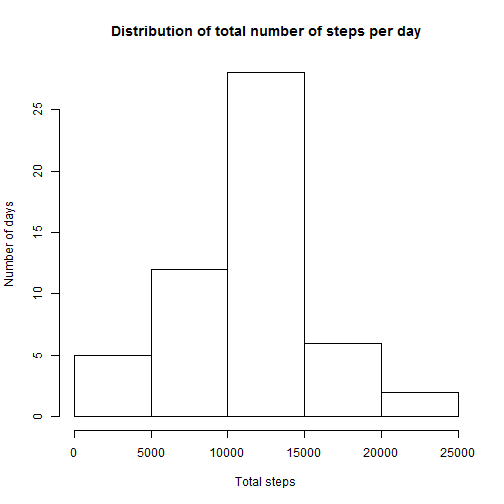
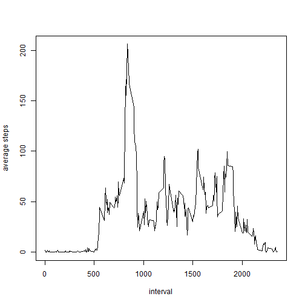
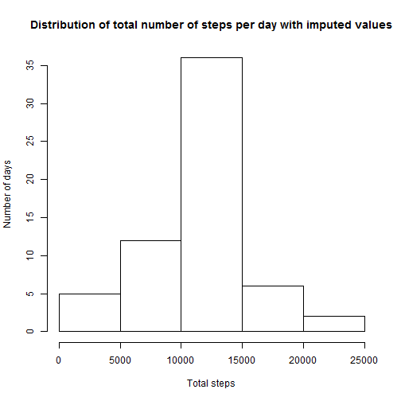
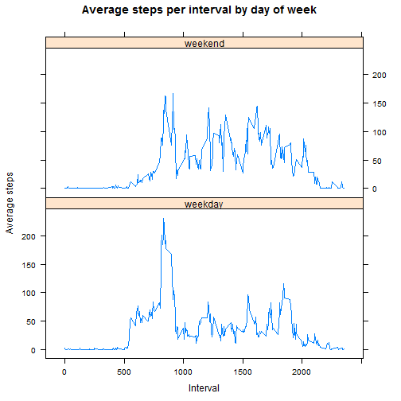

Reproducible Research: Peer Assessment 1
========================================

***

#### Load and preprocess the data.

Read in the CSV file and format the date variable.


```r
df <- read.csv("P:/Data Science/Coursera/5 Reproducible Research/activity.csv", header=T)
df$date <- as.Date(df$date, format="%Y-%m-%d")
```

***

#### What is mean total number of steps taken per day?


```r
hist(aggregate(steps~date, df, sum)[,2], main="Distribution of total number of steps per day", xlab="Total steps", ylab="Number of days")
```



```r
mean(aggregate(steps~date, df, sum)[,2], na.rm=TRUE)
```

```
## [1] 10766.19
```

```r
median(aggregate(steps~date, df, sum)[,2], na.rm=TRUE)
```

```
## [1] 10765
```

From the above output the mean of variable STEPS is 1.0766189 &times; 10<sup>4</sup> and the median is 10765.

***

#### What is the average daily activity pattern?


```r
mean.by.int <-  aggregate(steps~interval, df, mean )
plot(mean.by.int, type="l", ylab="average steps")
```



```r
head(mean.by.int[order(-mean.by.int$steps),],1)
```

```
##     interval    steps
## 104      835 206.1698
```

The 5-minute interval that contains the highest maximum number of steps (averaged across all days) is the 835 interval.

***

#### Imputing missing values


```r
table(complete.cases(df))
```

```
## 
## FALSE  TRUE 
##  2304 15264
```

There are a total number of 15264 rows with NA values.

Impute the missing value for steps with the average across all dates in that interval and create a new dataset.


```r
df.new <- merge(df, mean.by.int, all.x=TRUE, by='interval')
names(df.new) <- c("interval","steps_old","date","ave_steps")
df.new$steps <- ifelse(is.na(df.new$steps_old)==TRUE,df.new$ave_steps,df.new$steps_old)
df.new <- df.new[,c(1,3,5)]
```

Recreating the histogram above, we will examine the effect of using averages as the imputed value.


```r
hist(aggregate(steps~date, df.new, sum)[,2], main="Distribution of total number of steps per day with imputed values", xlab="Total steps", ylab="Number of days")
```



```r
mean(aggregate(steps~date, df.new, sum)[,2], na.rm=TRUE)
```

```
## [1] 10766.19
```

```r
median(aggregate(steps~date, df.new, sum)[,2], na.rm=TRUE)
```

```
## [1] 10766.19
```

After imputing the missing values, the new mean remains the same as before but the median is now equal to the mean.

***

#### Are there differences in activity patterns between weekdays and weekends?


```r
df.new$dayofweek <- ifelse(weekdays(df.new$date) %in% c("Saturday","Sunday"),'weekend','weekday')
mean.by.dow <- aggregate(steps~interval+dayofweek, df.new, mean)
library(lattice)
xyplot(steps~interval|dayofweek, type="l", data=mean.by.dow, main="Average steps per interval by day of week", ylab="Average steps", xlab="Interval", layout=(c(1,2)))
```



Comparing average steps per interval done during the weekend or weekdays it appears weekend intervals see more consistent activity. Weekday averages peak between the 700 and 800 interval.

***
